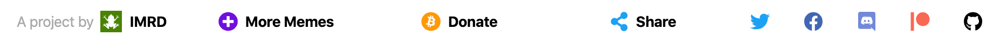

# IMRD Footer

Standard footer React component for IMRD's projects

By the <a href="https://memetic.institute" target="_blank">Institute for Memetic Research & Development</a>

[](index.js)

---

## Properties

| Property | Type     |
| -------- | -------- |
| homepage | `string` |
| tweet    | `shape`  |
| items    | `array`  |

See below:

```js
Footer.propTypes = {
    homepage: string,
    tweet: shape({
        url: string,
        handle: string,
        text: string,
        hashtags: arrayOf(string)
    }),
    items: arrayOf(
        shape({
            children: node,
            title: string,
            href: string,
            icon: shape({}),
            color: string,
            className: string
        })
    )
};

Footer.defaultProps = {
    homepage: 'https://memetic.institute',
    tweet: {
        url: 'https://memetic.institute',
        handle: 'memetic_insti2t',
        hashtags: ['imrd']
    },
    items: [
        {
            children: 'More Memes',
            href: 'https://memetic.institute/projects',
            icon: faPlusCircle,
            color: '#700fdd'
        },
        {
            children: 'Donate',
            href: 'https://memetic.institute/gib',
            icon: faBitcoin,
            color: '#f90'
        },
        {
            children: 'Share',
            className: 'share-twitter',
            get href() {
                return twitterIntent(this.tweet);
            },
            icon: faShareAlt,
            color: twitterColor,
            isTwitterIntent: true
        },
        [
            {
                title: 'Twitter',
                href: 'https://twitter.com/memetic_insti2t',
                icon: faTwitter,
                color: twitterColor
            },
            {
                title: 'Facebook',
                href:
                    'https://fb.me/institute.for.memetic.research.and.development',
                icon: faFacebook,
                color: '#4267B2'
            },
            {
                title: 'Discord',
                href: 'https://discord.gg/mUxVBb4',
                icon: faDiscord,
                color: '#7289DA'
            },
            {
                title: 'Patreon',
                href: 'https://www.patreon.com/memeticinstitute',
                icon: faPatreon,
                color: '#f96854'
            },
            {
                title: 'GitHub',
                href: 'https://github.com/memetic-institute',
                icon: faGithub,
                color: black
            }
        ]
    ]
};
```
